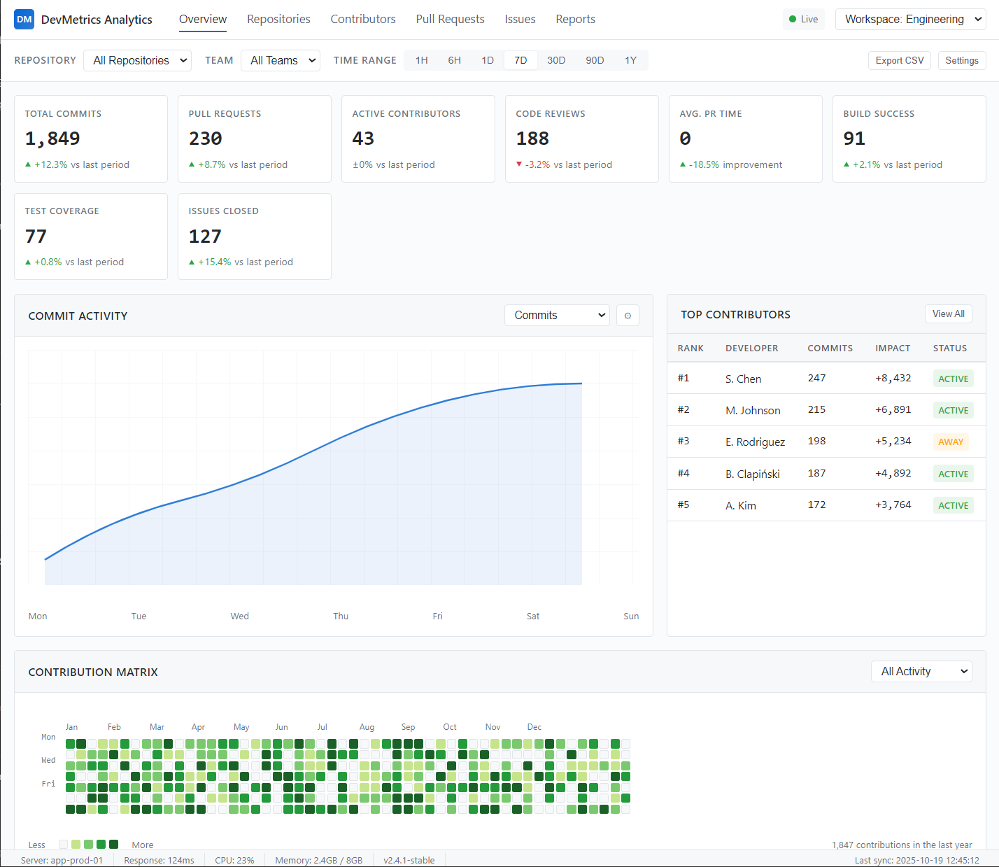

# DevMetrics Pro 📊

> Real-time developer analytics dashboard built with .NET 9 and Blazor Server

[](https://github.com/bartoszclapinski/DevMetricsPRO/actions)
[](https://opensource.org/licenses/MIT)
[](https://dotnet.microsoft.com/)
[](https://dotnet.microsoft.com/apps/aspnet/web-apps/blazor)

## 🚀 About

DevMetrics Pro is a comprehensive developer analytics platform that provides real-time insights into team productivity, code quality, and project health. It integrates with popular development tools to give you a unified view of your team's performance.

## 🎨 What DevMetrics Pro is about



*The dashboard will feature real-time metrics, interactive charts, and team leaderboards.*

### Key Features (Planned)

- 📊 **Real-time Dashboard** - Live metrics with SignalR updates
- 🔄 **Multi-Platform Integration** - GitHub, GitLab, and Jira support
- 📈 **Activity Tracking** - GitHub-style contribution heatmap
- 👥 **Team Analytics** - Leaderboards and productivity insights
- 📉 **Trend Analysis** - Track metrics over time
- 🎯 **Sprint Metrics** - Velocity and burndown charts

## 🛠 Tech Stack

### Backend
- **.NET 9** - Latest C# 12 features
- **Blazor Server** - Real-time interactive UI
- **ASP.NET Core Identity** - Authentication & authorization
- **Entity Framework Core 9** - ORM with PostgreSQL
- **SignalR** - Real-time communication
- **Hangfire** - Background job processing

### Database & Caching
- **PostgreSQL 16** - Primary database
- **TimescaleDB** - Time-series data optimization
- **Redis 7** - Distributed caching

### Frontend
- **MudBlazor** - Material Design component library
- **ApexCharts.Blazor** - Interactive charts
- **Fluxor** - State management

### DevOps
- **Docker** - Containerization
- **GitHub Actions** - CI/CD pipeline
- **Azure App Service** - Hosting (planned)

## 🏗 Architecture

This project follows **Clean Architecture** principles with clear separation of concerns:

```
┌─────────────────────────────────────┐
│         DevMetricsPro.Web           │  Presentation Layer
│         (Blazor Server)             │
├─────────────────────────────────────┤
│    DevMetricsPro.Infrastructure     │  External Services
│    (Data, APIs, Background Jobs)    │
├─────────────────────────────────────┤
│    DevMetricsPro.Application        │  Business Logic
│    (Services, DTOs, Validators)     │
├─────────────────────────────────────┤
│       DevMetricsPro.Core            │  Domain Layer
│       (Entities, Interfaces)        │
└─────────────────────────────────────┘
```

**Benefits:**
- ✅ Testable and maintainable
- ✅ Framework-independent business logic
- ✅ Clear dependency direction (inward)
- ✅ Easy to extend and modify

## 📝 Development Status

| Sprint | Status | Focus |
|--------|--------|-------|
| **Sprint 0** | 📋 Ready | Environment setup, project structure |
| **Sprint 1** | 📋 Ready | Foundation, database, authentication |
| **Sprint 2** | 📅 Planned | GitHub integration, background jobs |
| **Sprint 3** | 📅 Planned | Dashboard, real-time features |
| **Sprint 4** | 📅 Planned | Production readiness, deployment |

## 🚦 Getting Started

### Prerequisites

- [.NET 9 SDK](https://dotnet.microsoft.com/download/dotnet/9.0)
- [Docker Desktop](https://www.docker.com/products/docker-desktop)
- [Visual Studio 2022](https://visualstudio.microsoft.com/) or [VS Code](https://code.visualstudio.com/)
- [Git](https://git-scm.com/)

### Quick Start

```bash
# Clone the repository
git clone https://github.com/bartoszclapinski/DevMetricsPRO.git
cd DevMetricsPRO

# Start databases
docker-compose up -d

# Run migrations (once solution is created)
dotnet ef database update -p src/DevMetricsPro.Infrastructure -s src/DevMetricsPro.Web

# Run the application
dotnet run --project src/DevMetricsPro.Web

# Open browser
# https://localhost:5001
```

## 📚 Documentation

Comprehensive documentation is available in the [`.ai/`](.ai/) folder:

- **[Getting Started](.ai/GETTING-STARTED.md)** - Quick start guide for developers
- **[Product Requirements](.ai/prd.md)** - Complete PRD with technical specs
- **[Sprint Plans](.ai/sprints/)** - Detailed implementation plans
- **[Design Prototype](.ai/design/design-prototype.html)** - UI/UX reference

### For Developers

- **[Cursor Rules](.cursor/)** - AI-assisted development guidelines
  - Clean Architecture principles
  - .NET 9 & C# 12 conventions
  - Blazor best practices
  - Database guidelines
  - Testing standards

## 🧪 Testing

```bash
# Run all tests
dotnet test

# Run with coverage
dotnet test --collect:"XPlat Code Coverage"

# Run specific test project
dotnet test tests/DevMetricsPro.Application.Tests
```

**Coverage Goal:** 80% minimum

## 🔄 CI/CD

Every push and pull request triggers automated checks:

- ✅ Build verification
- ✅ Unit & integration tests
- ✅ Code quality analysis
- ✅ Security scanning
- ✅ Format verification

See [.github/README.md](.github/README.md) for details.

## 🤝 Contributing

This is a learning project, but contributions are welcome!

1. Fork the repository
2. Create a feature branch (`git checkout -b feature/amazing-feature`)
3. Follow the coding standards in `.cursor/` folder
4. Commit your changes (`git commit -m 'feat: add amazing feature'`)
5. Push to the branch (`git push origin feature/amazing-feature`)
6. Open a Pull Request

**Commit Convention:** This project follows [Conventional Commits](https://www.conventionalcommits.org/)
- `feat:` - New feature
- `fix:` - Bug fix
- `docs:` - Documentation
- `refactor:` - Code refactoring
- `test:` - Adding tests
- `chore:` - Maintenance

## 📄 License

This project is licensed under the MIT License - see the [LICENSE](LICENSE) file for details.

## 👨‍💻 Author

**Bartosz Clapiński**

Building this project to learn:
- .NET 9 and Blazor Server
- Clean Architecture principles
- Real-time web applications with SignalR
- DevOps and CI/CD practices

## 🎯 Project Goals

This project serves multiple purposes:

1. **Learning** - Deep dive into .NET 9, Blazor, and Clean Architecture
2. **Portfolio** - Showcase modern .NET development practices
3. **Building in Public** - Document the journey from idea to production
4. **Best Practices** - Implement industry-standard patterns and principles

## 📈 Roadmap

### Phase 1: MVP (Sprints 0-4)
- [x] Project setup and documentation
- [x] CI/CD pipeline
- [ ] Core foundation with authentication
- [ ] GitHub integration
- [ ] Real-time dashboard
- [ ] Production deployment

### Phase 2: Enhancement (Sprint 5+)
- [ ] GitLab integration
- [ ] Jira integration
- [ ] Advanced analytics
- [ ] Export functionality
- [ ] Mobile responsiveness
- [ ] Performance optimization

### Phase 3: Advanced Features
- [ ] AI-powered insights
- [ ] Predictive analytics
- [ ] Custom dashboards
- [ ] API for third-party integrations

## 🌟 Acknowledgments

- [MudBlazor](https://mudblazor.com/) - Beautiful Blazor component library
- [Clean Architecture](https://blog.cleancoder.com/uncle-bob/2012/08/13/the-clean-architecture.html) - Robert C. Martin (Uncle Bob)
- [.NET Team](https://github.com/dotnet) - For the amazing framework

---

⭐ **Star this repo** if you find it useful!

📧 **Questions?** Open an issue or reach out!

🚀 **Following the journey?** Watch this repo for updates!

